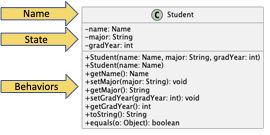
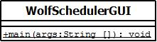
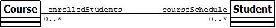
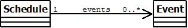
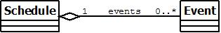
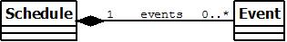

After requirements are defined for a software system, developers start working on a design.  The goal of a software design is to decide on the structure of the software and the hardware configurations that support it.  There are three main levels of software design: architecture, high-level design (HLD), and low-level design (LLD).  All software designs model the structure of a system.  The structure includes *components*, *interfaces*, and *relationships*.  We use several diagrams to support the analysis model of the requirements and our representation of a software design.  The diagrams, and other software artifacts related to design, will be detailed further below.

Software design evolves over time and may be refined as designers learn more about the system.  A well-formed design provides functionality for the software system described in the requirements.  A class in an object-oriented design should be complete and sufficient for the appropriate encapsulation of the class' state and behaviors.  Additionally, each class should be focused on one idea, abstraction, or service and the behaviors of the class should be cohesive and support that single responsibility.  Finally, a class should have low coupling or minimize it's collaborations or relationships with other classes.  If classes in a software system are highly coupled, in that they have relationships with all other classes in the system, then the system is vulnerable to failures when one component of the system changes.  Software systems with low coupling are more resilient to changes.

When creating a software design, you want to understand the requirements so that you know how the application will be used.  The design of a stand-alone application is very different from the design of a web application.  

**Goal:**  Decide the structure of the software and the hardware configurations that support it

**Software Artifacts:** design documents, class diagrams, other UML diagrams

## Architecture
Architecture provides a representation or abstraction of a software system at a very high-level.  The architecture can characterize a software system and provides a common language for communication.  There are several common architectures:

* **Data-Centered**: All components of the system interact with a common data repository, typically a relational database.
* **Call and Return**: Components consist of subprograms invoked through a main program.  Subprograms may invoke other subprograms forming a hierarchical or tree structure.
* **Layered**: Components are layered by their functionality.  Most web applications use a layered architecture.  
* **Model-view-controller**: Components are divided into the model (e.g., business logic), the view (e.g., the user interface), and the controller (e.g, the connection between the view and model).  Model-view-controller architectures are also common in web applications.

All applications developed in {{site.data.comprehensive-exercise.course-short}} are stand-alone Java applications that use the model-view-controller (MVC) architecture.  Since we are developing in Java, the view and controller are tightly coupled.  That means they are represented in a single class which is the GUI class.  The view is the look and feel of the application and includes the standard form components and the layout of those components.  The controller portion of the GUI class are the methods that are executed when a component, like a button, is interacted with by the user.  When a button is clicked the controller method will call a method in the underlying model.  We typically have a class that represents the overarching model of the system that the controller methods interact with.  The overarching model class will then delegate to the other classes in the system as appropriate for their abstraction.
 
## Low-level Design
For object-oriented systems, low-level design describes the classes, including their state and behaviors, and the relationship between those classes.  Our low-level design must conform to the model-view-controller architecture and the classes will each belong to a package described in the high-level design.  When creating a low-level design, we start by discovering classes and their state.  The next step is to determine the responsibilities of each class.  Finally, we describe the relationships between each class.  

There are several diagram types that describe low-level design. 

* **Class Diagrams**: Class diagrams are a type of UML diagram, which describe the classes, states, behaviors, and relationships between classes for a software system. 
* **Control-flow Diagrams**: Control-flow diagrams model the flow-oriented elements of a software system.  Control-flow diagrams can model the flow of control between methods or within a method and may be used to estimate the number of unit tests needed to fully exercise all paths in a method.  
* **State Diagrams**: State diagrams describe the behavioral elements of a software system.  State diagrams are frequently used to model finite state machines and show how inputs to the system can change the internal state of a class.  State diagrams are typically implemented using the State Pattern.
* **Sequence Diagrams**: Sequence diagrams describe the behavioral elements of a software system by modeling the call chain of methods for a scenario.  A scenario is a single path through a use case; system tests are scenarios exercised against the system to evaluate if the validity of the software.  A sequence diagram models a series of method calls and returns for a given scenario.

## Class Diagrams
Class diagrams are a type of UML diagram, which describe the classes, states, behaviors, and relationships between classes for a software system.  When analyzing requirements, we identify *nouns* which could represent objects or an object's state and *verbs* which could represent a class' behaviors.  We then create a UML diagram to represent classes as an abstraction of a single responsibility and the relationships between classes.

__Supporting tool:__ UML Editors, such as [Draw.io](https://www.draw.io/){:target="_blank"} - Online tool to draw diagrams

### Classes
In a UML class diagram, classes are represented by a box divided into three sections stacked vertically.  The top section contains the class name, and in some diagrams may also include the package name.  The middle section contains the class' state or fields.  The bottom section lists the class' behavior.  

The state and behaviors of a class are written so that you can directly translate them to the code for fields and methods.  Both state and behaviors have a leading symbol that represents the visibility of the item.  A `+` (or green circle) represents public, `-` (or red square) represents private, `#` represents package, and no symbol represents default access.  

Recall: 

* public: Any class can use the field or method through an instance of the object or the class itself (if the field or method is static).
* private: No external class can use the field or method.
* protected: An external class that is a subclass of the given class or in the same package as the given class can use the field or method through an instance of the object or the class itself (if the field or method is static).
* default: An external class that is in the same package as the given class can use the field or method through an instance of the object or the class itself (if the field or method is static).

The visibility is followed by the name of the element.  For example, there is a field named `eventName` and two methods named `isConflict`.  A method's name is followed by parentheses that may include a parameter list.  The parameter list could just list the types of the parameters in order.  The parameters may also include names.  If so, the name is listed first, followed by a colon (e.g., `:`), then the type.

The type of the state or behaviors is listed at the end of the line following a colon (e.g., `:`).  The method's type is the return type, which means the method can also be treated as that type in code!

A static field or method (e.g., the main method) is annotated with an underline.  There is not a specific notation for final fields.

### Composition (has-a)
A composition relationship is when one class has or uses an instance of another class.  There are several connectors that are used to model a composition relationship depending on the nature or strength of the relationship.  All connectors, except the dependency connector, represent when a class has a field (is a container) that is an instance of another class (the contained).  That means the connector is annotated with information about the field like the field name.  Since the connector represents the field, it is redundant to list the field in the container class.  The connector may also be annotated with numbers that represent the multiplicity of the connection.  If there is only a single instance of the contained in the container, the multiplicity is noted as a 1.  If there are multiple objects of the contained type in the container, the multiplicity is noted as 0..*, or zero to many.  That means the container stores the contained type in some type of collection like an array or object from the Java Collections Framework.

#### Association Connector

An association connector is a solid line between the container and the contained.  If the relationship is bi-directional, which means that each class contains an instance or collection of the other, the connector is a solid line.  The connector is annotated with the field names for each class.  In the example below, `Course` would have a field called `enrolledStudents` which would contain a collection of `Student`s.  `Student` would have a field called `courseSchedule` containing a collection of `Course`s.

  

  If the relationship is uni-directional, the arrow points to the contained class.  In the example below, `Schedule` has a field called `events` which would contain a collection of `Event`s.
  
  
  
#### Aggregation Connector

An aggregation connector is a solid line between the container and the contained with an open diamond at the end next to the container.  An aggregation connector models a whole-part relationship where the contained class represents a part of the container or whole class where the part can exist separate from the whole.  For example, a car has wheels or the wheel is part of a car.  But the wheel can exist separate from the car.  In an above example, we showed that a schedule has events.  If we consider a schedule as a whole that is made up of events, the more appropriate connector for the relationship would be aggregation.

  

#### Composition Connector

A composition connector is a solid line between the container and the contained with a solid diamond at the end next to the container.  Like an aggregation connector, a composition connector models a whole-part relationships where the contained class represents a part of the container or the whole class.  Unlike the aggregation connector, a composition connector should be used when the part cannot exist separate from the whole or when the whole controls the entire life cycle of the part.  For example, a line item doesn't exist separate from an invoice.  If we consider a schedule as controlling the life cycle of events and that an event cannot exist outside of a schedule, we could model the relationship using a composition connector.  A composition connector may be used to model inner classes since the outer class controls the life cycle of the inner class.

  
  
#### Dependency Connector

A dependency connector is a dashed line between the container and the contained.  The arrow points to the contained.  A dependency connector is used to show when a class uses an instance of another class as a local variable or a parameter type, but not as a field.  Since there are usually many dependencies between classes in a design, the dependency connector is frequently omitted from class diagrams.