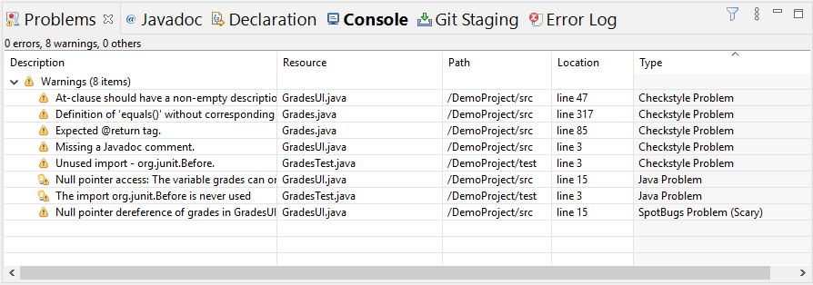

# CSC216 Lab 00: Pair Programming and Installation
For [Lab 00](https://docs.google.com/a/ncsu.edu/presentation/d/e/2PACX-1vTz25GRywqHLJpSLpZ448HEJy0NP3UJ_dRz2Ecqn6PTp_Yq9izFZhGV-McFCyeaVSOgHyhTFe-9DPIX/pub?start=false&loop=false&delayms=60000), you will complete a pair programming activity (on-campus students only); learn about GitHub, the version control system we use in CSC216; and set up your development environment for CSC216. 



  * Practice working on a pair or small team to understand the benefits
  * Learn about the version control system GitHub
  * Set up a development environment for CS216



## Pair Activity (On-Campus Students Only)

Your lab PTF will lead you through a lab pair activity that explores responsible computing.

## GitHub Overview

We'll be using [NCSU's GitHub Enterprise service](http://github.ncsu.edu) for submission of most work in CSC216 this semester.  Take a look through the [GitHub tutorial](https://pages.github.ncsu.edu/engr-csc216-staff/CSC216-SE-Materials/git-tutorial/).  It's an excellent resource for when you run into issues with GitHub (which is used in most CSC classes from this point forward and GitHub or similar tools are used in industry - version control is something that you have to know to be an effective developer).

## Development Environment Installation


After the pair programming activity is complete, you will have the opportunity to set up your development environment with the help of your lab PTF.  Go through the [Eclipse Install Tutorial](../../install/).  If you have any questions, the PTFs are there to help you out.  

You MUST demonstrate the following to your lab PTF for full credit on setting up your development environment.  If you don't have a laptop that can run Eclipse, you can record a video of your desktop environment where you demonstrate the following steps. 

### Step 1: Launch Eclipse
Launch Eclipse and show that all plug-ins are installed.  You can see the icons for installed plug-ins by selecting **Help > About Eclipse IDE.** The icons of the required plug-ins are highlighted in red and may appear in a different order than the screenshot.  


**Demo:** Eclipse is open

### Step 2: Import Demo Project
To ensure that all of the plug-ins are configured correctly, download the [Demo Eclipse Project](files/demo.zip).  Import the project into your workspace:

  1. Right click in the **Package Explorer** and select **Import > General > Existing Projects into Workspace**.  Click **Next**.
  2. Select the radio button **Select archive file** and **Browse** for `demo.zip`. 
  3. Make sure that `DemoProject` is selected in the **Projects** text area and click **Finish**.
  4. `DemoProject` should now be listed in the **Package Explorer**.
  
Wait a bit for the project to build.  If your project has a big red exclamation point icon over the project folder your project was unable to build due to a path issue within Eclipse.  To fix, do the following:

  1. Right click on the project and select **Properties > Java Build Path > Libraries tab**. 
  2. Select the JRE System Library (which will be labeled unbound) and click **Remove**.
  3. Click **Add Library...**.
  4. Select **JRE System Library**. Click **Next**.
  5. Select the radio button for **Workspace default JRE (jdk 1.8 name)**. Click **Finish**.  Note that the jdk 1.8 name will vary depending on the name of your local default JRE.  If your default JRE is not version 1.8, go back to the [Java in Eclipse section of the Install Tutorial](../../install/#java-in-eclipse).
  
**Demo:** Open the DemoProject and ensure that the JRE System Library is listed as `[JavaSE-1.8]`

![*JRE System Library [JavaSE-1.8]*](images/Java.PNG)

### Step 3: Run CheckStyle
CheckStyle needs to be turned on for each project so that it will run with every build.  To activate CheckStyle for a project, do the following:

  1. Right click on the project and select **Properties > Checkstyle**.
  2. Click the check box next to **Checkstyle active for this project**.  Ensure that the CSC216 configuration is selected.
  3. Click **Apply and Close**.
  
After running CheckStyle you should see 4 notifications in the **Problems** view.  If you see more than this, you didn't [configure CheckStyle properly](../../install/#checkstyle).

**Demo:** Appropriate notifications are displayed.



### Step 4: Run SpotBugs
SpotBugs needs to be turned on for each project so that it will run with every build.  To activate SpotBugs for a project, do the following:

  1. Right click on the project and select **Properties > SpotBugs**.
  2. Click the check box next to **Run automatically**.
  3. Click **Apply and Close**.
  
After running SpotBugs you should see 1 notification in the **Problems** view of type **SpotBugs Problem**.  If you see more than this, you didn't [configure SpotBugs properly](../../install/#spotbugs).

**Demo:** Appropriate notifications are displayed.


### Step 5: Run PMD
PMD needs to be turned on for each project so that it will run with every build.  To activate PMD for a project, do the following:

  1. Right click on the project and select **Properties > PMD**.
  2. Click the check box next to **Enable PMD**.
  3. Click **Apply and Close**.
  
To see PMD notifications, you need to add the PMD **Violations Overview** view to your Java Perspective by selecting **Windows/Eclipse > Other > PMD > Violations Overview**.  There should be 12 PMD notifications across the `src/` and `test/` folders. If you see more than this, you didn't [configure PMD properly](../../install/#pmd).

**Demo:** Appropriate notifications are displayed.


### Step 6: Run Unit Tests for Coverage
We will run automated unit tests on our code this semester and assess the quality of tests through code coverage.  To run unit tests instrumented for coverage, do the following:

  1. Open the project.  Right click on the `test/` folder and select **Coverage As > JUnit Test**.
  2. The tests will run and results will show with a red bar.  X out of Y tests are failing.
  3. A coverage report will show. In the upper right menu, select the white triangle pointing down and click on **Line counters**. You'll see 53.9% line coverage for the `Grades` class; 0% line coverage for `GradesUI` class; and 90% line coverage for `GradesTest` class.
  
**Demo:** Appropriate test results and coverage are displayed.


### Step 7: Git Configuration in Eclipse
Ensure that you have [configured Git in Eclipse](../../install/#git-configuration) with your name and NCSU email address. You can demonstrate the configuration by:

  1. Select
     * Windows users: **Window > Preferences > Team > Git > Configuration**.
     * Mac users: **Eclipse > Preferences > Team > Git > Configuration**.
  2. Open up the **user** label to show **name** and **email** address.  You *MUST* use your NCSU email address.
  
**Demo:** Your name and NCSU email address are displayed.


### Step 8: Push Demo Project to GitHub
You have been assigned a GitHub repository for Lab 00.  Push your DemoProject to GitHub.  See [slides 26-29](https://docs.google.com/presentation/d/e/2PACX-1vTz25GRywqHLJpSLpZ448HEJy0NP3UJ_dRz2Ecqn6PTp_Yq9izFZhGV-McFCyeaVSOgHyhTFe-9DPIX/pub?start=false&loop=false&delayms=60000&slide=id.g4b93c18dbe_1_87), the [Git Tutorial](https://pages.github.ncsu.edu/engr-csc216-staff/CSC216-SE-Materials/git-tutorial/), or the [Git instructions from Guided Project 1](https://pages.github.ncsu.edu/engr-csc216-staff/CSC216-SE-Materials/gp1/gp1-github.html).

When you're done, check on NCSU's GitHub website that the `DemoProject` folder is listed.


### Step 9 [optional + extra credit]: Git Configuration on Command Line
If you have [installed Git for your operating system and configured your global user name and email settings](https://pages.github.ncsu.edu/engr-csc216-staff/CSC216-SE-Materials/git-tutorial/git-config.html), show the PTF via the following commands from your favorite command line tool:

```bash
$ git config --list
```

**Demo:** Your name and NCSU email address are displayed.

## Lab Deadlines
There are three parts to Lab 00: 1) participation in the pair programming activity (on-campus only & in-lab), 2) review of GitHub, and 3) demonstration that you have successfully set up your personal development environment.  Participation in the pair programming activity will occur during lab.  The deadline for demonstration of your personal development environment is the end of Lab 01.  You must show your setup to your lab PTF (or another PTF during office hours) before the end of your Lab 01 section.

## Lab Rubric
You will be evaluated on 1) demonstration that you have successfully set up your personal development environment by the end of Lab 01 and 2) your participation in the lab pair programming activity (on-campus students only)

### Development Environment Setup Rubric

|Rubric Item|Points|Description|
|:----------|----------:|:------------------------------------------------------|
| CheckStyle Notifications | 10 | Correct CheckStyle notifications are displayed demonstrating installation of plug-in and configuration file. |
| SpotBugs Notifications | 10 | Correct SpotBugs notifications are displayed demonstrating installation of plug-in and configuration file. |
| PMD Notifications | 10 | Correct PMD notifications are displayed demonstrating installation of plug-in and configuration file. |
| Java 1.8 | 15 | Java 1.8 is the default JDK in Eclipse |
| Coverage Report | 10 | Coverage when running unit tests is correctly generated. |
| Eclipse Git Configuration | 15 | User name and email are set in Eclipse's eGit settings. |
| DemoProject Committed to GitHub | 15 | DemoProject committed to GitHub in the correct folder structure. |
| **Extra Credit**: Command Line Git Configuration | 5 | Command line Git user name and email are set up. |
| **TOTAL** | 70 | |

### On-Campus Students

|Rubric Item|Points|Description|
|:----------|----------:|:------------------------------------------------------|
| Pair Programming Activity | 30 | Participate in pair programming activity |
| **TOTAL** | 30 | |