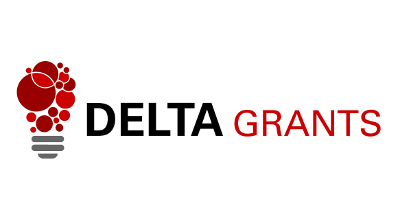

# SOS - Computing Education Research (SOS-CER)

*Studying Computing Education through a Software Engineering Lens*

The SOS-CER group is run by [Dr. Sarah Heckman](https://people.engr.ncsu.edu/sesmith5/), [Dr. Jason King](https://people.engr.ncsu.edu/jtking/) and [Dr. Jessica Young Schmidt](https://people.engr.ncsu.edu/jdyoung2/) as part of the [Department of Computer Science](https://www.csc.ncsu.edu) at [NC State University](https://www.ncsu.edu).

## Projects

  * [Automated Grading Tools](projects/auto-grading)
  * [CS2 Labs](projects/labs.html)
  <!--* [TA Training](projects/ta-training)-->
  * [Introduction to Git Version Control Guide](projects/git-guide)
  * [CS1 Comprehensive Exercise](comprehensive-exercise)

## Publications

  * J.Y. Schmidt, "Reviewing CS1 Materials through a Collaborative Software Engineering Exercise: An Experience Report," in Proceedings of the 51st ACM Technical Symposium on Computer Science Education, New York, NY, USA, 2020.
  * S. Heckman and J. King, "Developing Software Engineering Skills using Real Tools for Automated Grading," in Proceedings of the 49th ACM Technical Symposium on Computer Science Education, New York, NY, USA, 2018, p. 794-799.
  * M. Vellukunnel, P. Buffum, K. E. Boyer, J. Forbes, S. Heckman, K. Mayer-Patel, "Deconstructing the Discussion Forum: Student Questions and Computer Science Learning," SIGCSE 2017, pp. 603-608. (Acceptance Rate: 30%)
  * A. Smith, K. E. Boyer, J. Forbes, S. Heckman, K. Mayer-Patel, "My Digital Hand: A Tool for Scaling Up One-to-One Peer Teaching in Support of Computer Science Learning," SIGCSE 2017, pp. 549-554. (Acceptance Rate: 30%)

## Support

  * [Google CS Capacity Award](https://research.googleblog.com/2015/03/google-computer-science-capacity-awards.html)
    * In collaboration with Duke University, University of North Carolina - Chapel Hill, and the University of Florida 
  * [NSF: Collaborative Research: Transforming Computer Science Education Research Through Use of Appropriate Empirical Research Methods: Mentoring and Tutorials](https://www.nsf.gov/awardsearch/showAward?AWD_ID=1525173&HistoricalAwards=false)
  * [Google CS Engagement Award](http://www.csc.ncsu.edu/news/1748)
  * [NC State DELTA Course Redesign Grant](http://www.csc.ncsu.edu/news/1802)
  

{:height="50px"}
{:height="100px" width="100px"}
{:height="100px"}

